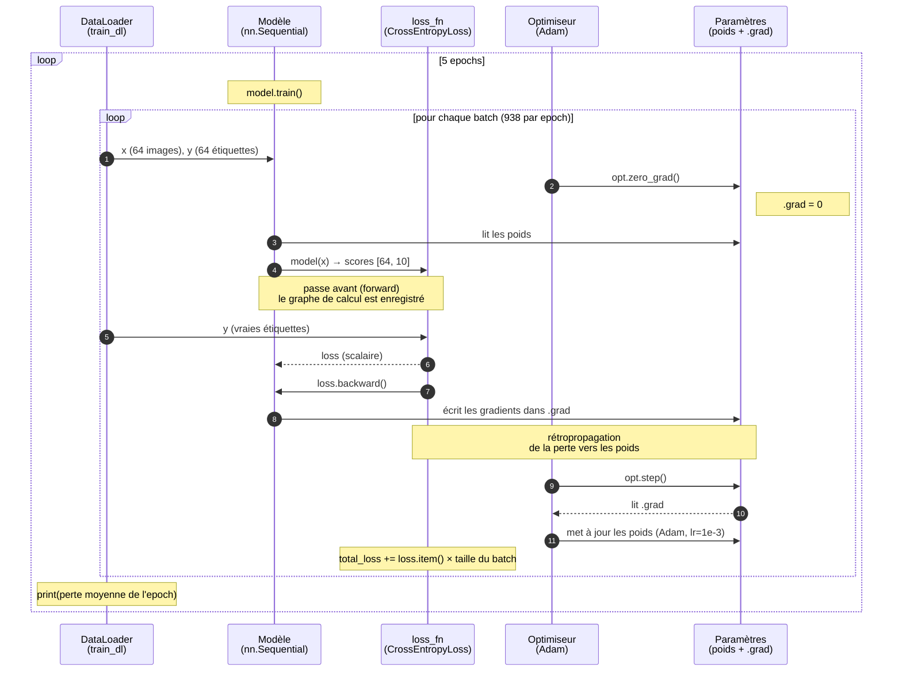

# Boucle d'entraînement MNIST : diagramme de séquence

```mermaid
sequenceDiagram
    autonumber
    participant DL as DataLoader<br/>(train_dl)
    participant M as Modèle<br/>(nn.Sequential)
    participant L as loss_fn<br/>(CrossEntropyLoss)
    participant O as Optimiseur<br/>(Adam)
    participant P as Paramètres<br/>(poids + .grad)

    loop 5 epochs
        Note over M: model.train()
        loop pour chaque batch (938 par epoch)
            DL->>M: x (64 images), y (64 étiquettes)

            O->>P: opt.zero_grad()
            Note right of P: .grad = 0

            M->>P: lit les poids
            M->>L: model(x) → scores [64, 10]
            Note over M,L: passe avant (forward)<br/>le graphe de calcul est enregistré
            DL->>L: y (vraies étiquettes)
            L-->>M: loss (scalaire)

            L->>M: loss.backward()
            M->>P: écrit les gradients dans .grad
            Note over L,P: rétropropagation<br/>de la perte vers les poids

            O->>P: opt.step()
            P-->>O: lit .grad
            O->>P: met à jour les poids (Adam, lr=1e-3)

            Note over L: total_loss += loss.item() × taille du batch
        end
        Note over DL: print(perte moyenne de l'epoch)
    end
```
